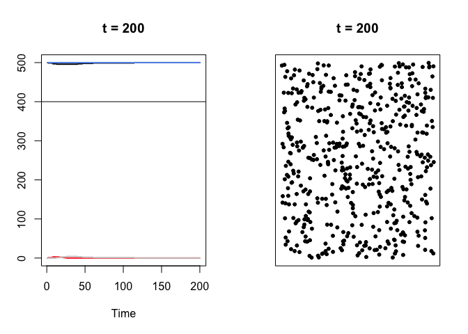
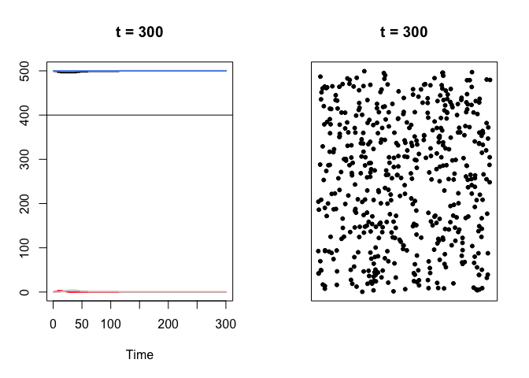

# {PandemicSim}: Simulate pandemics

With this package you can simulate a pandemic for a population of dots
living in a small box. You have a lot of options to change the pandemic.
For example you can change the number of individuals or increase the
population’s mobility. You can also make the disease more infectious or
more deadly and you can change how fast individuals recover. You can
even simulate the effect of countermeasures.

## Installation

``` r
devtools::install_github("janoleko/PandemicSim")
```

## Example

First simulate the pandemic (in this case with default settings, but you
could change them)

``` r
pandemic = sim_pandemic()
```

Then plot the result

``` r
plot_pandemic(pandemic, t = 100)
```


``` r
plot_pandemic(pandemic, t = 200)
```



``` r
plot_pandemic(pandemic, t = 300)
```


